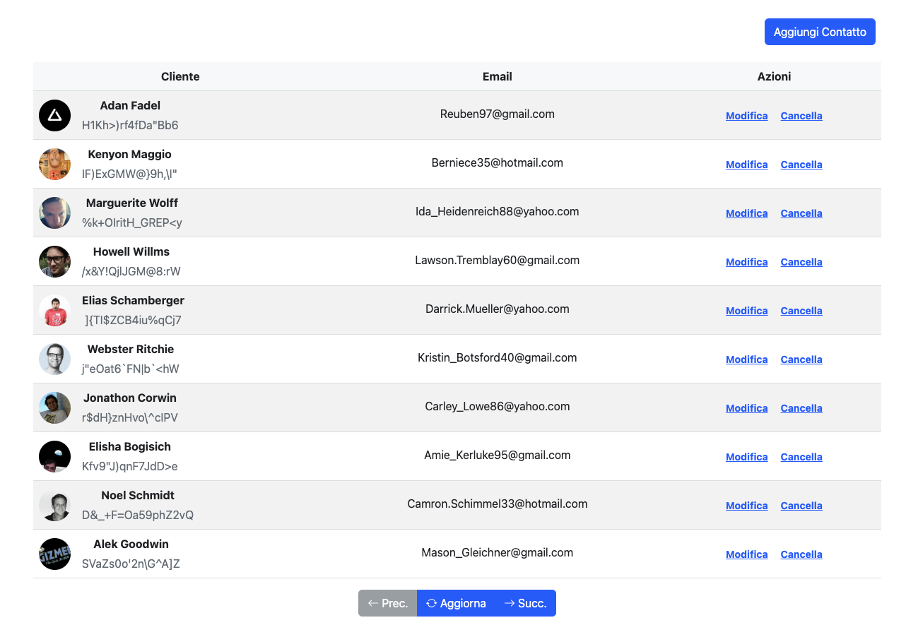

# ContactList

This project was generated with [Angular CLI](https://github.com/angular/angular-cli) version 12.2.9.

## Project Description

'Contact-list' is a simple Angular app that implements CRUD operations for a contact-list.
<br/>

<br/>

BackendApis are implemented via Mirage.
I chose it instead of JSON Server because Mirage mock out the exact shape of your production API and because it and I've never used it.

The frontend toolkit choosed is Bootstrap (required from Icert)

I have included the partner functionality in a separate module in order to use it separatly anywhere.
In this folder i have created many subfolders (components/ interfaces...).
In my mind every feature/functionality of an app must have its folder.

The Pagination feature is implemented via factory pattern [view here](./src/app/pagination/services/PaginatorFactory.ts): different pagination methods can be implemented (e.g sqlite/http...).
The important thing is to implement correctly interfaces [view here](./src/app/pagination/interfaces/Paginator.interface.ts).


I choosed Angular NgRx Entity to manage partners entity.
Because of this I have created crudInterface [view here](./src/app/partners/services/partner-crud.service.ts) to manage DI:
if I want to manage entities in other ways (for example simple http....) just change the dependency implementation.
Example:
```export class PartnerCrudService implements crudInterface<PartnerExtended>{
  constructor(
    private genericPartnerES: OtherFavoriteServiceImplementation
  ){...}
```
The project needs many little/big things (view TODOS)


## Development server

Run `ng serve` for a dev server. Navigate to `http://localhost:4200/`. The app will automatically reload if you change any of the source files.

## Code scaffolding

Run `ng generate component component-name` to generate a new component. You can also use `ng generate directive|pipe|service|class|guard|interface|enum|module`.

## Build

Run `ng build` to build the project. The build artifacts will be stored in the `dist/` directory.

## Running unit tests

Run `ng test` to execute the unit tests via [Karma](https://karma-runner.github.io).

## Running end-to-end tests

Run `ng e2e` to execute the end-to-end tests via a platform of your choice. To use this command, you need to first add a package that implements end-to-end testing capabilities.

## Further help

To get more help on the Angular CLI use `ng help` or go check out the [Angular CLI Overview and Command Reference](https://angular.io/cli) page.
